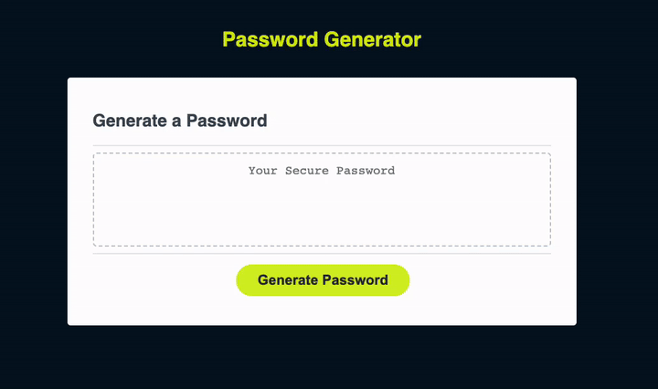

# security-keygen

## Table of Contents

- [Description](#description)
- [User Story](#user-story)
- [Acceptance Criteria](#acceptance-criteria)
- [Images](#images) 
- [Link To Deployed Webpage on GitHub](#link-url-to-deployed-webpage-on-github)
- [Installation](#installation)
- [Technologies Used](#technologies-used)
- [Credits](#credits)
- [License](#license)

## Description

The goal of this web application was to use the skills we learned for Javacript to create a password generator or security keygen based on a few factors.

These factors or criteria include the use of:
- Uppercase Letters (A-Z)
- Lower Case Letters (a-z)
- Number (0 - 9)
- Special Symbols (!@#$%...)
- Character count no less than 8 and no more than 128 in length.

The end user will select a Character Value. If the user selects a value outside of the given given criteria, they will be prompted that their selection is invalid and to enter another value. If the end user selects a value within the criteria, they will be prompted with a set of information that they can click ok or cancel out. If they click ok, the newly generated password will then be written in the textbox area and now they can copy/paste/save.

## User Story
- AS AN employee with access to sensitive data
- I WANT to randomly generate a password that meets certain criteria
- SO THAT I can create a strong password that provides greater security

## Acceptance Criteria
- GIVEN I need a new, secure password
- WHEN I click the button to generate a password
- THEN I am presented with a series of prompts for password criteria
- WHEN prompted for password criteria
- THEN I select which criteria to include in the password
- WHEN prompted for the length of the password
- THEN I choose a length of at least 8 characters and no more than 128 characters
- WHEN asked for character types to include in the password
- THEN I confirm whether or not to include lowercase, uppercase, numeric, and/or special characters
- WHEN I answer each prompt
- THEN my input should be validated and at least one character type should be selected
- WHEN all prompts are answered
- THEN a password is generated that matches the selected criteria
- WHEN the password is generated
- THEN the password is either displayed in an alert or written to the page

## Images

## Link URL to deployed webpage on GitHub
https://cynthiamory.github.io/security-keygen/

## Installation

N/A

## Technologies Used
Assignment was built with:
- HTML5
- Advanced CSS
- Javascript
- VS Code
- Github

## Credits
- Webpage by: Cynthia Morales - Full Stack Developer Student
- Code Snippets Resource for work images: W3 Schools, Medium, Reddit, CodeWithMosh, Javascript.info,  
- Institution: The University Of Toronto
- Course: Bootcamp Full Stack Development
- Instructor: Ali Masqood
- Tutor: Andres Long
- Student Peer Help: Sunday Study Group, Shanel Bebee, Jung In Kim (James) Austin Grech

## License

N/A